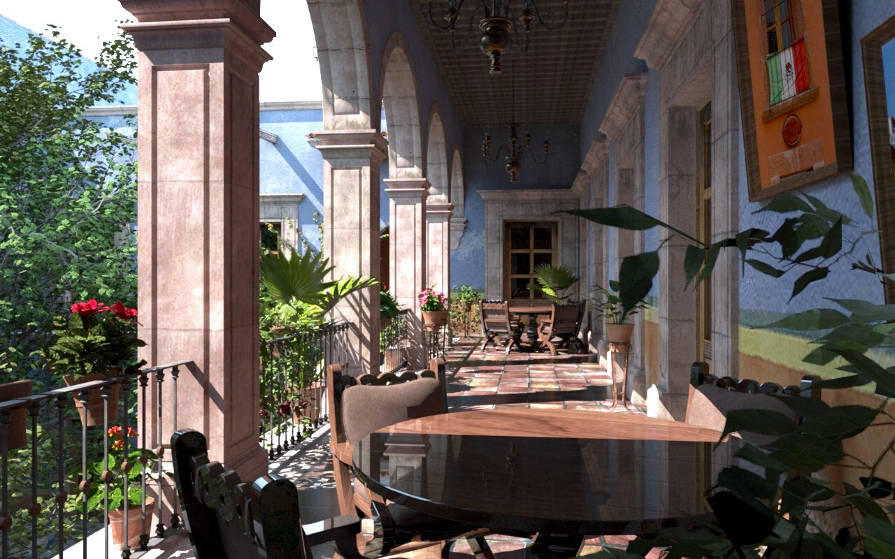

**EDXRay** is a physically based render independently developed by [Edward Liu](http://behindthepixels.io/). It is built with modern C++. Aside from many low level optimizations, parallelism is exploited on both thread level and instruction level so it's highly performant. It includes many state of the art algorithms published in recent years in light transport simulation, material modelling, sampling and reconstruction, camera models as well as participating media.

The source code of EDXRay is highly self-contained and does not depend on any external library other than [EDXUtil](https://github.com/behindthepixels/EDXUtil), which is a utility library developed by Edward Liu.

EDXRay is currently built and tested only on Windows platform. Developer using Visual Studio 2015 should be able to build the source code immediately after syncing. Porting to Linux or macOS should not be difficult since it there is no external dependency.

## List of Features

### Integrators
- Volumetric Path Tracing
- Bidirectional Path Tracing with Multiple Importance Sampling
- Multiplexed Metroplis Light Transport

### Materials
- Lambertion Diffuse
- Smooth Conductor
- Smooth Dielectric
- Rough Conductor
- Rough Dielectric
- Disney BRDF
  - Layered Material with Up to 2 Specular Coats
  - Cloth
- Subsurface Scattering
  - BSSRDF based on Normalized Diffusion
  - Participating Media
- Normal Map
- Roughness Map
- Alpha Test

### Acceleration Structure
- Optimized BVH traversal and Triangle Intersection with SSE
- Multi-threaded BVH Construction
- [Embree](https://embree.github.io/) can be optionally used (Introduce external dependency)

### Light Source
- Point Light
- Directional Light
- Polygonal Area Light
- Procedural Sky Light with Hosek Model
- HDR Probe

### Camera Models
- Thin Lens Model
- Fisheye Camera
- Realistic Camera Parameters
- Arbitrarily Shaped Bokeh
- Vignette and Cateye effect

### Sampler
- Independent Sampler
- Sobol Sequence with Screen Space Index Enumeration

## Gallery

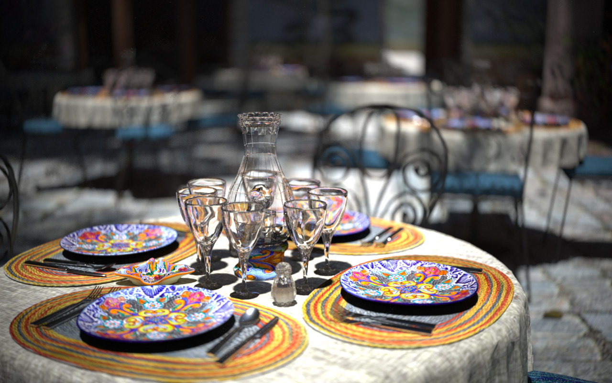  
*Simulated depth of field, vignette and cateye effect*

---
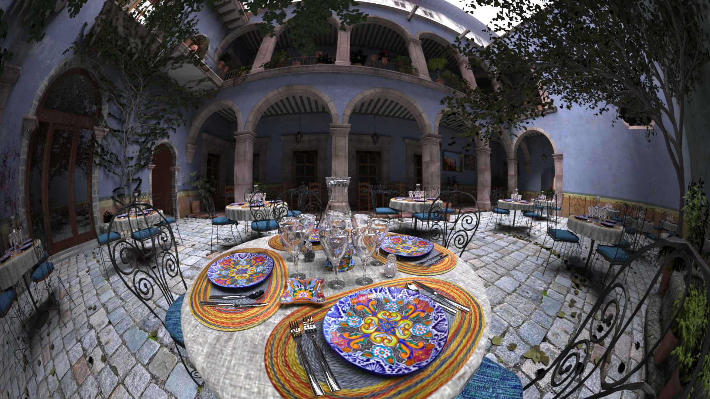  
*Simulated super wide fish eye lens*

---
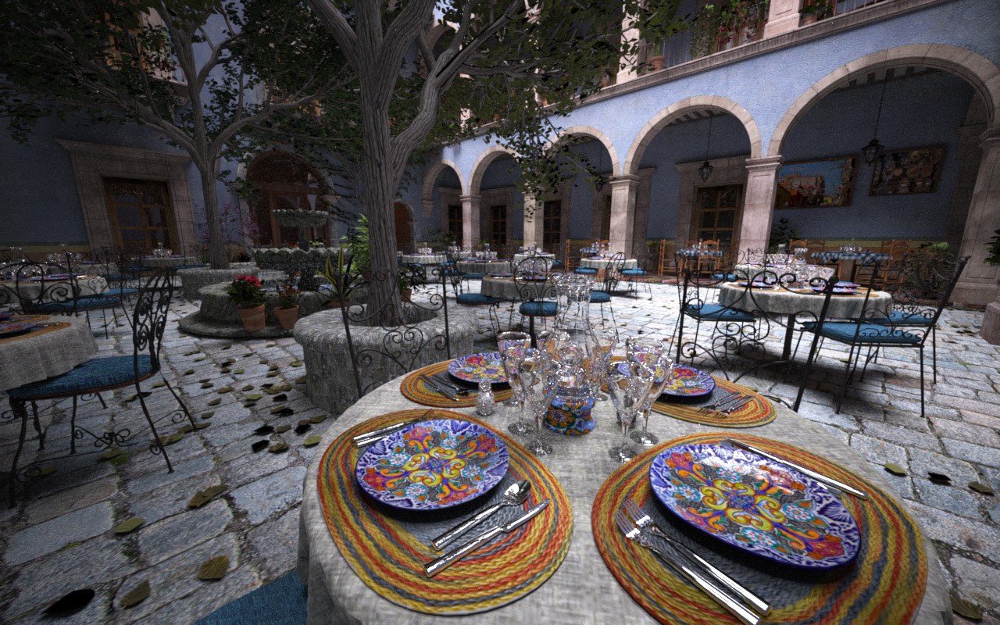  
*Focal length 14mm wide angle shot*

---
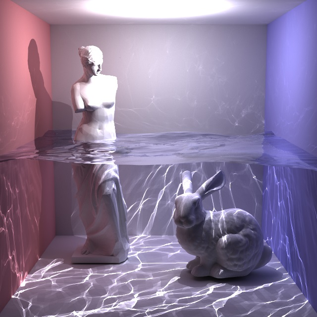  
*Caustics simulated with bidirectional path tracing*

---
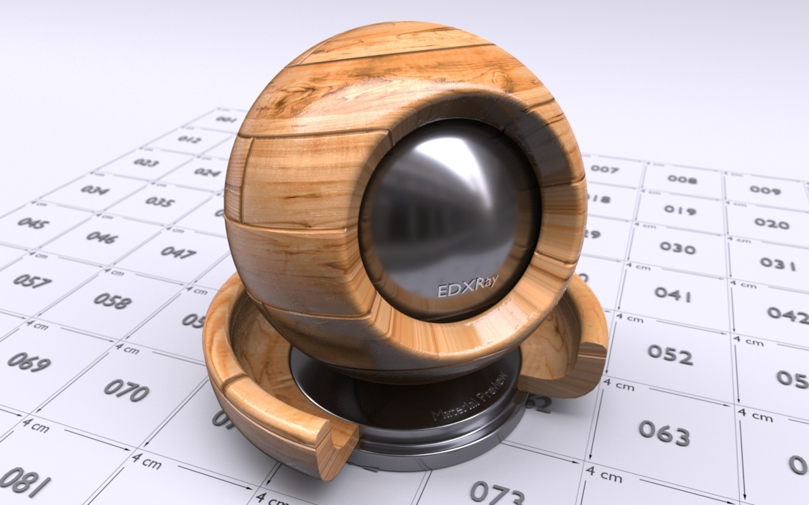  
*Wooden floor modeled with Disney BRDF*

---
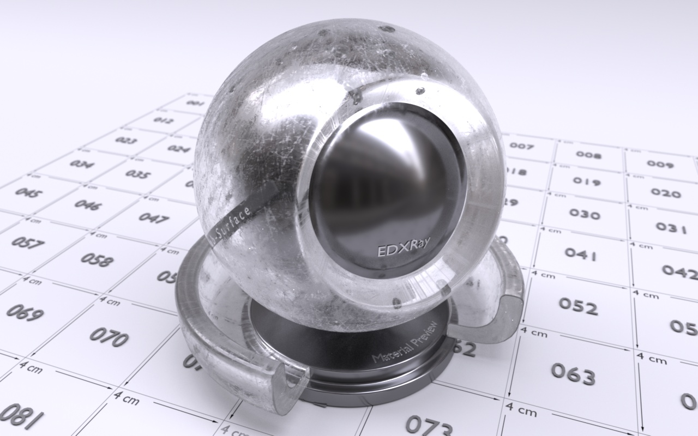  
*Rough glass modeled GGX*

---
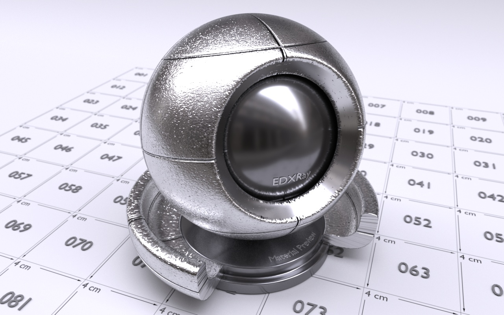  
*Rough metal modeled GGX*

---
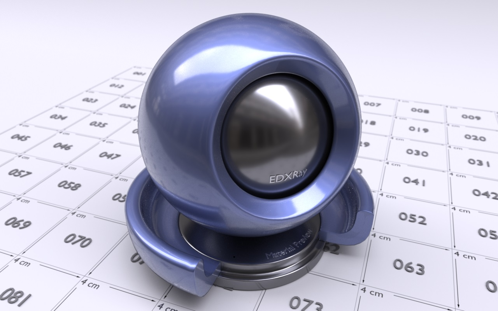  
*Car paint modeled with Disney BRDF*

---
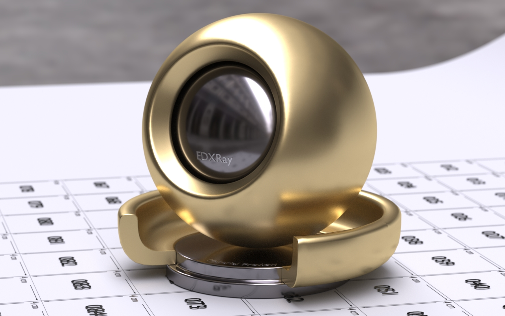  
*Gold*

---
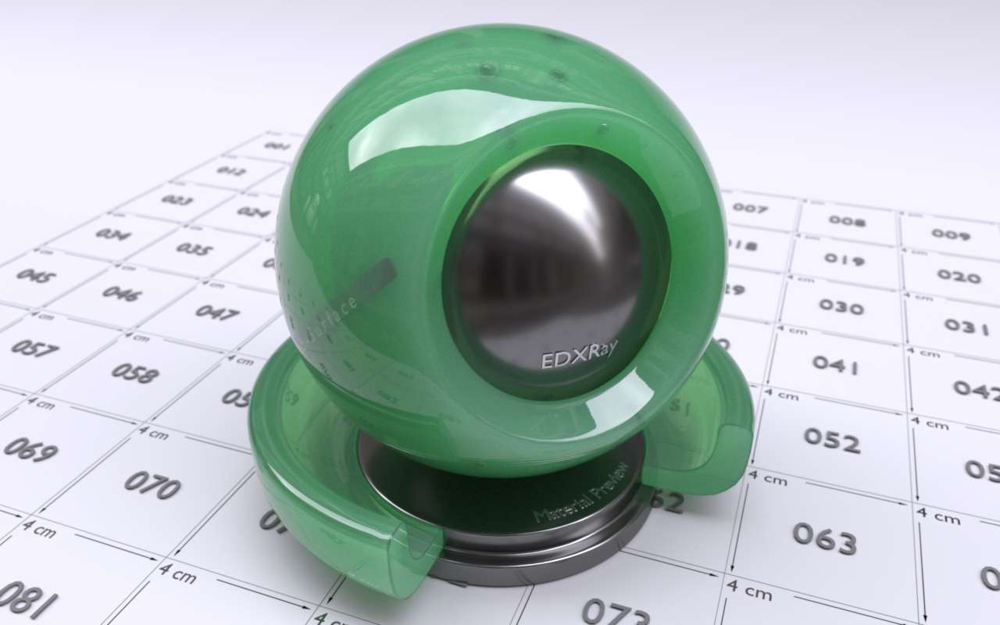  
*Jade modeled with participating media*

---
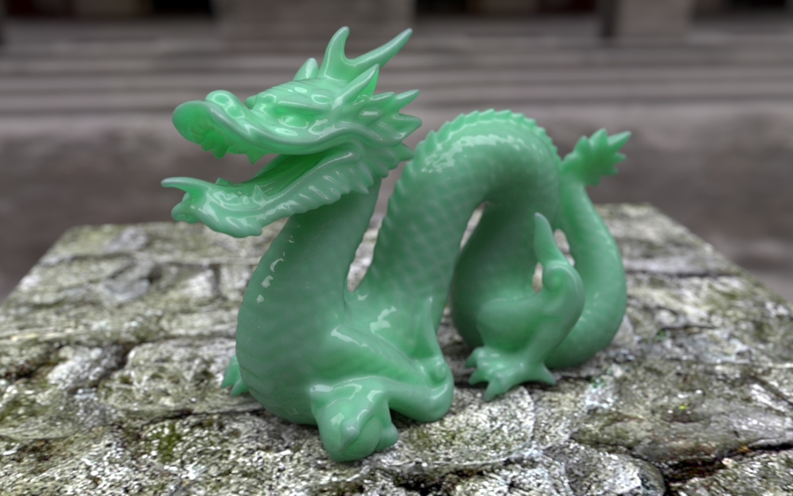  
*Jade dragon modeled with BSSRDF*

---
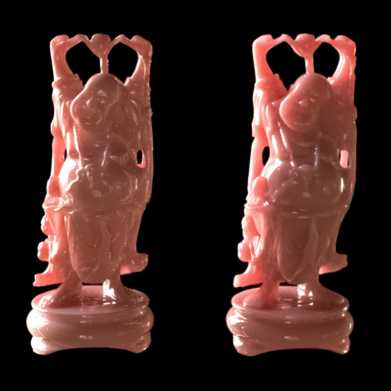  
*Side by side comparison between BSSRDF (left) and participating media (right)*

---
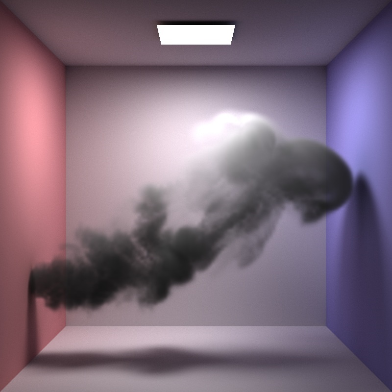  
*Smoke rendered with participating media*
